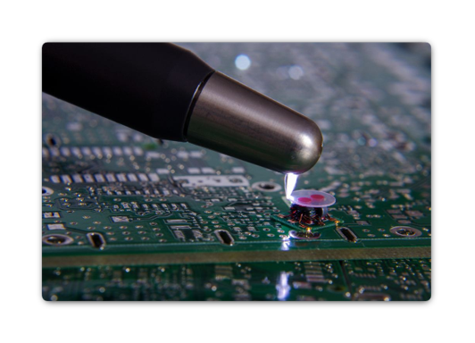

# Chapitre 1 - Architecture d'un ordinateur moderne

## Comment utiliser ce chapitre ?

Ce chapitre présente l'ordinateur comme un système : chaque composant a un rôle, mais il ne fonctionne que si ses interfaces, son connecteur physique, son alimentation, son format et son refroidissement sont compatibles avec le reste de la plateforme.


Pour chaque composant, posez cinq questions : que fait-il? Par quelle interface communique-t-il? Dans quel connecteur s'installe-t-il? Comment est-il alimenté? Quelles contraintes de compatibilité et de température faut-il vérifier ?&#x20;


## Objectifs d'apprentissage&#x20;

•     Identifier visuellement les principaux composants internes d'un PC moderne.

•     Associer chaque composant à ses interfaces, ses connecteurs et son mode d'alimentation.

•     Distinguer x86-64 et ARM64, chipset et SoC, cœurs homogènes et cœurs hybrides.

•     Comparer DDR4 et DDR5, GPU intégré et GPU dédié, ainsi que CPU, GPU et NPU.

•     Interpréter PCIe, M.2 et SATA sans confondre format physique, bus et protocole.

•     Vérifier une chaîne de compatibilité avant l'achat ou l'installation d'une pièce.

•     Expliquer le chemin de la chaleur et diagnostiquer un refroidissement insuffisant.

## Sécurité électrique et décharges électrostatiques

<figure><figcaption>
<em>Source de l'image</em> : <a href="https://www.netacad.com/courses/it-essentials?courseLang=en-US">Cisco IT Essentials</a>
</figcaption></figure>

* Une décharge électrostatique (ESD) peut se produire en cas d'accumulation d'une charge électrique (électricité statique) sur une surface entrant en contact avec une autre surface chargée différemment.
* Une décharge électrostatique peut endommager un équipement informatique qui n'a pas été correctement déchargé.
* L'électricité statique doit atteindre au moins 3 000 volts pour qu'une personne ressente une décharge.
* Suivez les recommandations ci-dessous pour empêcher les dégâts causés par les décharges électrostatiques :
  * Conservez tous les composants dans des sacs antistatiques tant que vous n'êtes pas prêt à les installer.
  * Utilisez des tapis mis à la terre sur les tables de travail.
  * Utilisez des tapis de sol mis à la terre dans les espaces de travail.
  * Utilisez des bracelets antistatiques lorsque vous intervenez sur des ordinateurs.

## Composants de l'ordinateur&#x20;

### 1. Boitiers&#x20;

Le boîtier héberge les composants internes, notamment le module d'alimentation, la carte mère, le processeur, la mémoire, les disques durs et les cartes d'extension.

Le terme « facteur de forme » (ou format) fait référence à la conception physique et à l'aspect d'un boîtier. Les ordinateurs de bureau standard existent dans divers formats, notamment :Boîtier horizontal
, tour pleine taille
, tour compacte
, tout-en-un..

De nombreux fabricants de boîtiers peuvent posséder leur propre convention d'attribution de noms, à savoir super tour, tour complète, tour moyenne, mini-tour, boîtier cube, etc

<figure><figcaption>
<em>Source de l'image</em> : <a href="https://www.netacad.com/courses/it-essentials?courseLang=en-US">Cisco IT Essentials</a>
</figcaption></figure>

### 2. Bloc d'alimentation (PSU)

#### 2.1. Rôle et fonctionnement

Le bloc d’alimentation, ou **PSU (Power Supply Unit)**, convertit le courant alternatif de la prise électrique en courant continu utilisable par les composants du PC. Il fournit principalement du **12 V**, ainsi que du **5 V et du 3,3 V** pour certains circuits et périphériques.

La puissance indiquée en watts représente **la puissance maximale que le bloc d’alimentation peut fournir**. Par exemple, un bloc de 850 W peut fournir jusqu’à 850 W, mais il fournit seulement la puissance dont les composants ont besoin (Par exemple, si l’ordinateur a besoin de 300 W, le bloc fournit environ **300 W**, même s’il est capable d’aller jusqu’à 850 W)&#x20;

#### 2.2. Formats et caractéristiques

* ATX : Format dominant des ordinateurs de bureau, vaste choix de puissance et de câbles. Actuellement, on trouve :&#x20;
  * **ATX12V** : utilise généralement un connecteur CPU **4 broches**. Il convient aux processeurs ayant des besoins énergétiques modestes.
  * **EPS12V** : utilise généralement un connecteur CPU **8 broches (4+4)**. Il peut fournir davantage de puissance et convient mieux aux processeurs modernes et plus performants.
* SFX et SFX-L : formats compacts pour les petits boitiers; la puissance et le bruit doivent être évalué avec soin.
* Non modulaire : tous les câbles sont fixés au bloc; économique, mais plus encombrant.
* Semi-modulaire : les câbles essentiels sont fixes; les autres sont détachables.
* Modulaire : tous les câbles sont détachables; facilite le montage et la circulation d'air.

#### 2.3. Interfaces et connecteurs associés&#x20;

| Connecteur                     | À quoi il sert ?                                                | À retenir                                                        | À quoi ressemble t'il ?              |
| ------------------------------ | --------------------------------------------------------------- | ---------------------------------------------------------------- | ------------------------------------ |
| ATX 24 broches                 | Alimente la **carte mère**                                      | C’est le connecteur principal de la carte mère.                  | .png>) |
| EPS12V 4+4 / 8 broches         | Alimente le **processeur (CPU)**                                | Se trouve près du processeur.                                    | .png>) |
| PCIe 6+2 broches               | Alimente la **carte graphique (GPU)**                           | Peut être utilisé en 6 ou 8 broches selon la carte graphique.    | .png>) |
| 12V-2x6 – 16 broches           | Alimente certaines **cartes graphiques récentes et puissantes** | Peut fournir beaucoup de puissance.                              | .png>) |
| SATA alimentation – 15 broches | Alimente les **SSD SATA, disques durs et certains accessoires** | Connecteur très courant pour les périphériques de stockage SATA. | .png>) |


Attention : les PC Dell et HP utilisent souvent des connecteurs d’alimentation propriétaires( 6 ou 8 broches) à la place du connecteur ATX 24 broches standard. Il faut toujours vérifier le modèle avant de remplacer le bloc d’alimentation.


#### 2.4. Choisir une alimentation&#x20;

* **Choisir une puissance suffisante** pour le processeur, la carte graphique et les autres composants, avec une petite marge de sécurité.
* **Vérifier la compatibilité** avec le boîtier : taille du bloc, connecteurs disponibles et longueur des câbles.
* **Choisir une alimentation de bonne qualité**, avec des protections contre les surtensions, surcharges, courts-circuits et surchauffes.
* Pour une **carte graphique puissante**, utiliser de préférence le câble prévu par le fabricant et éviter les adaptateurs non recommandés.

### 3. Carte mère, Chipset et SoC&#x20;

<figure><figcaption>
<em>Source de l'image</em> : <a href="https://www.netacad.com/courses/it-essentials?courseLang=en-US">Cisco IT Essentials</a>
</figcaption></figure>

La carte mère est un circuit imprimé multicouche qui relie et alimente les composants. Ses pistes transportent des données et des signaux; ses plans internes distribuent l'alimentation et la masse. Le modèle de carte mère détermine le socket du processeur, le type de RAM, le nombre de voies PCIe, les interfaces de stockage, les ports disponibles et les possibilités d'évolution.

<figure><figcaption>
<em>Exemple annoté d'une carte mère de bureau et de ses principaux connecteurs. Source :</em> <a href="https://github.com/crazygmr/ComputerAssemblyForNewbs"><em>https://github.com/crazygmr/ComputerAssemblyForNewbs</em></a>
</figcaption></figure>

#### 3.1. Facteurs de forme&#x20;

| Format   | Dimensions usuelles | Forces                                                          | Contraintes                                             |
| -------- | ------------------- | --------------------------------------------------------------- | ------------------------------------------------------- |
| ATX      | 305 x 244 mm        | Plus de slots, de connecteurs et d'espace autour des composants | Boîtier plus grand                                      |
| MicroATX | jusqu'à 244 x 244 m | Bon compromis coût, taille et extension                         | Moins de slots que l'ATX                                |
| Mini-ITX | 170 x 170 mm        | PC compact                                                      | Peu de slots; montage et refroidissement plus exigeants |

#### 3.2. Chipset moderne et SoC&#x20;

La Chipset est un contrôleur de la carte mère qui gère une partie des communications entre le processeur et les périphériques.


Anciennement, La plupart des chipsets appartiennent aux deux types suivants :
\
\- Northbridge : permet un accès rapide à la mémoire RAM et à la carte vidéo.
\
\- Southbridge : permet au processeur de communiquer avec des périphériques plus lents, comme des disques durs, des ports USB ou des slots d'extension


Dans un PC moderne, le processeur intègre généralement le contrôleur mémoire et des voies PCIe rapides; la carte mère conserve un chipset, , qui ajoute des ports PCIe, USB, SATA et d'autres fonctions d'entrée-sortie.

<figure><figcaption>
Chipset sur une carte mère. Source : <a href="https://www.utmel.com/blog/categories/integrated%20circuit/what-is-a-chipset">https://www.utmel.com/blog/categories/integrated%20circuit/what-is-a-chipset</a>
</figcaption></figure>

Un **SoC (System on Chip)** regroupe plusieurs composants importants dans une seule puce : le **processeur (CPU)**, souvent le **GPU**, le **contrôleur mémoire**, parfois le **NPU** et d’autres fonctions.

Cela permet de fabriquer des ordinateurs **plus compacts, moins énergivores et plus simples à refroidir**.

On retrouve surtout les SoC dans les **ordinateurs portables, les appareils ARM64 et les PC très fins**.

#### 3.3. Interfaces et connecteurs associés à la carte mère

<table data-search="false"><thead><tr><th>Connecteur</th><th>Composant relié</th><th>À quoi rassemble t'il ?</th></tr></thead><tbody><tr><td>Socket CPU</td><td>Processeur</td><td></td></tr><tr><td>EPS 12V </td><td>Processeur</td><td></td></tr><tr><td>Slots DIMM</td><td>Modules de RAM</td><td></td></tr><tr><td>Slots PCIe x1/x4/x8/x16</td><td>Cartes d'extensions</td><td></td></tr><tr><td>Socket M.2</td><td>SSD SATA , NVMe</td><td></td></tr><tr><td>Ports SATA 7 broches</td><td>HDD, SATA, lecteurs optiques</td><td></td></tr><tr><td>CPU_FAN, SYS_FAN</td><td>Ventilateurs</td><td></td></tr><tr><td>F_Panel, </td><td>Boutons, DEL </td><td></td></tr><tr><td>USB 2.0/3.x/USB-C</td><td>Ports USB du boitier</td><td></td></tr><tr><td>ATX 24 broches </td><td>Carte mère </td><td></td></tr></tbody></table>

#### 3.4. La pile CMOS&#x20;

La **pile CMOS**, aussi appelée **pile RTC (Real-Time Clock)**, est une petite pile située sur la carte mère.  Elle permet principalement de conserver **l’heure et la date** lorsque l’ordinateur est éteint et débranché. Sur les systèmes modernes, les paramètres du BIOS/UEFI sont généralement stockés dans une mémoire non volatile, mais la pile continue d’alimenter l’horloge interne. Lorsqu’elle est faible, l’ordinateur peut perdre l’heure et afficher des messages d’erreur au démarrage.

<figure><figcaption></figcaption></figure>

### 4. Le processeur (CPU)&#x20;

Le processeur, ou CPU, exécute les instructions des programmes. Il charge des instructions et des données, les décode, effectue des opérations, puis écrit les résultats. Les performances dépendent de l'architecture, du nombre de cœurs, de la fréquence, des caches, de la mémoire, de la consommation permise et du logiciel.

#### 4.1. Caractéristiques et des termes liés au processeur

* **Cœur (Core)** : partie du processeur qui exécute les instructions. Un processeur avec plusieurs cœurs peut effectuer plusieurs tâches en même temps. Par exemple, un processeur **8 cœurs** peut répartir le travail entre ses 8 cœurs.
* **Thread logique** : tâche que le processeur peut traiter. Certains cœurs peuvent gérer **deux threads en même temps**, ce qui permet au processeur de mieux utiliser ses ressources. Par exemple, un processeur de **8 cœurs / 16 threads** possède 8 cœurs physiques, mais Windows peut voir 16 unités de traitement.
* **Cache L1 / L2 / L3** : petites mémoires très rapides situées dans ou près du processeur. Elles gardent temporairement les données dont le processeur a souvent besoin afin d'éviter d'aller les chercher dans la RAM, qui est plus lente. **L1 est la plus rapide et la plus petite**, puis viennent L2 et L3.
* **Fréquence** : vitesse de fonctionnement du processeur, généralement exprimée en **GHz**. Par exemple, un processeur à **4 GHz** effectue environ 4 milliards de cycles par seconde. La fréquence peut augmenter automatiquement avec le **Turbo/Boost** lorsque le processeur a besoin de plus de puissance.
* **TDP** : valeur exprimée en **watts (W)** qui donne une idée de la quantité de chaleur que le système de refroidissement doit pouvoir évacuer. Par exemple, un processeur avec un TDP de **65 W** nécessite un refroidissement adapté.&#x20;

#### 4.2. x86-64 et ARM64

**x86-64** et **ARM64** sont deux architectures de processeurs. Elles déterminent quelles instructions le processeur peut comprendre et comment il les exécute.

| x86-64                                               | ARM64                                           |
| ---------------------------------------------------- | ----------------------------------------------- |
| Surtout utilisé sur les PC et serveurs               | Très utilisé sur téléphones et PC récents       |
| Principalement Intel et AMD                          | Utilisé par Apple, Qualcomm et plusieurs autres |
| Très grande compatibilité avec les anciens logiciels | Souvent plus économe en énergie                 |
| Très répandu avec Windows et Linux                   | Utilisé avec Windows, macOS et Linux            |

#### 4.3. Cœurs hybrides&#x20;

Un processeur à **cœurs hybrides** contient deux types de cœurs qui travaillent ensemble :

* **P-cores (Performance)** : cœurs plus puissants, utilisés pour les tâches exigeantes comme les jeux, le montage vidéo ou les logiciels lourds.
* **E-cores (Efficiency)** : cœurs plus économes en énergie, utilisés pour les tâches plus simples ou celles qui fonctionnent en arrière-plan.

Le système d’exploitation choisit automatiquement quels cœurs utiliser selon la tâche.

#### 4.4. Le Socket&#x20;

Le **socket** est l’emplacement sur la carte mère où le processeur est installé. Le processeur et le socket doivent être **compatibles**.

| Type    | Description                                          | À retenir                                                        |
| ------- | ---------------------------------------------------- | ---------------------------------------------------------------- |
| **LGA** | Les broches sont dans le socket de la carte mère.    | Faire attention à ne pas plier les broches du socket.            |
| **PGA** | Les broches sont sous le processeur.                 | Manipuler le processeur avec soin pour ne pas plier les broches. |
| **BGA** | Le processeur est soudé directement à la carte mère. | Il n’est généralement pas remplaçable facilement.                |

<figure><figcaption>
Différence entre LGA et PGA. Source : <a href="https://tech4gamers.com/am5-vs-am4/">https://tech4gamers.com/am5-vs-am4/</a>
</figcaption></figure>

### 5. La mémoire&#x20;

#### 5.1. Type de mémoire

La **mémoire** permet à l’ordinateur de conserver des informations et des instructions. On distingue principalement deux types de mémoire:&#x20;

* **Mémoire vive (RAM)** : mémoire **temporaire et rapide** utilisée pour les programmes et les données en cours d’utilisation. Son contenu est perdu lorsque l’ordinateur s’éteint.
* **Mémoire morte (ROM)** : mémoire **permanente** qui conserve ses données même lorsque l’ordinateur est éteint. Elle contient notamment des informations nécessaires au démarrage.

#### 5.2. La mémoire ROM&#x20;

La **ROM (Read-Only Memory)** est une mémoire **non volatile**, c’est-à-dire qu’elle conserve les informations même lorsque l’ordinateur est éteint. Elle sert principalement à stocker des programmes ou des données nécessaires au fonctionnement et au démarrage d’un appareil.

<figure><figcaption>
Gros plan sur la puce ROM de BIOS d'une carte mère. Source : PC Perspective
</figcaption></figure>

Les types de mémoire morte (ROM) sont les suivants :

* **ROM classique (Mask ROM)** : programmée lors de sa fabrication et normalement impossible à modifier.
* **PROM** : peut être programmée **une seule fois** après sa fabrication.
* **EPROM** : peut être effacée avec de la **lumière ultraviolette**, puis reprogrammée.
* **EEPROM** : peut être effacée et reprogrammée **électriquement**.
* **Mémoire Flash** : forme moderne d’EEPROM, plus rapide et pratique. Elle est notamment utilisée pour stocker le **firmware BIOS/UEFI** des cartes mères.


Dans les ordinateurs modernes, lorsqu’on parle de « ROM du BIOS », il s’agit généralement d’une **mémoire Flash** qui peut être mise à jour


#### 5.3. La mémoire RAM

La **RAM** est la mémoire de travail de l’ordinateur. Elle garde temporairement les programmes et les données que le processeur utilise. Son contenu disparaît lorsque l’ordinateur est éteint.

* **Capacité** : quantité de mémoire disponible, exprimée en **Go**. Plus il y a de RAM, plus l’ordinateur peut faire fonctionner plusieurs programmes en même temps.
* **Vitesse** : indique à quelle vitesse la RAM peut envoyer et recevoir des données. Elle est généralement exprimée en **MT/s (MegaTransfers par seconde**)
* **Latence** : temps nécessaire à la RAM pour répondre à une demande. Une latence plus faible est généralement préférable.
* **Canaux** : permettent au processeur de communiquer avec plusieurs modules de RAM en parallèle. Par exemple, deux barrettes bien installées peuvent fonctionner en **dual channel** et améliorer les performances.

5.3.1. Type de RAM :&#x20;

Aujourd’hui, on rencontre surtout **DDR4, DDR5 et LPDDR5/LPDDR5X**.

* **DDR4** : génération encore très présente dans les ordinateurs un peu plus anciens. Elle offre de bonnes performances et coûte généralement moins cher, mais elle est progressivement remplacée par la DDR5.
* **DDR5** : génération actuelle utilisée dans la majorité des nouveaux PC. Elle offre des **vitesses plus élevées**, une meilleure efficacité et permet des capacités importantes.

| Caractéristique            | DDR4                                             | DDR5                                                                          |
| -------------------------- | ------------------------------------------------ | ----------------------------------------------------------------------------- |
| Tension nominale JEDEC     | 1,2 V                                            | 1,1 V                                                                         |
| Débits normalisés courants | jusqu'à 3200 MT/s dans la spécification courante | commence typiquement à 4800 MT/s sur PC; valeurs supérieures selon plateforme |
| Compatibilité physique     | DIMM 288 broches avec détrompeur DDR4            | DIMM 288 broches avec détrompeur différent; non compatible DDR4               |

* **LPDDR5 / LPDDR5X** : mémoire conçue surtout pour les **ordinateurs portables, téléphones et appareils mobiles**. Elle consomme moins d’énergie que la DDR5 classique et aide à améliorer l’autonomie. Elle est souvent soudée à la carte mère et n’est donc pas remplaçable.

5.3.1. Modules de RAM :&#x20;

* **DIMM** : barrette de RAM utilisée principalement dans les **ordinateurs de bureau**. Elle est plus grande et s’installe dans les emplacements mémoire de la carte mère.

<figure><figcaption>
Module RAM DIMM
</figcaption></figure>

* **SO-DIMM** : version plus petite du DIMM, utilisée surtout dans les **ordinateurs portables et mini-PC**.

<figure><figcaption>
Module RAM SO-DIMM
</figcaption></figure>

### 6. La carte graphique (GPU)&#x20;

La **carte graphique** s’occupe principalement de produire et d’afficher les **images, vidéos, animations et graphiques**. Elle peut aussi accélérer certains calculs comme l’intelligence artificielle ou le montage vidéo.

<figure><figcaption>
Carte Graphique. Source : <a href="https://www.techpowerup.com/review/asus-geforce-gtx-1650-strix-oc/">https://www.techpowerup.com/review/asus-geforce-gtx-1650-strix-oc/</a>
</figcaption></figure>

* **GPU intégré** : intégré au **processeur ou au SoC**. Il utilise généralement une partie de la RAM de l’ordinateur. Il consomme moins d’énergie et convient aux tâches courantes : bureautique, navigation Web et vidéos.
* **GPU dédié** : composant graphique séparé, généralement installé sur une **carte graphique PCIe**. Il possède sa propre mémoire appelée **VRAM** et offre de meilleures performances pour les jeux, la 3D, le montage vidéo et les applications exigeantes.

<table data-header-hidden data-search="false"><thead><tr><th>Aspect</th><th>GPU intégré (iGPU)</th><th>GPU dédié (dGPU)</th></tr></thead><tbody><tr><td>Aspect</td><td>GPU intégré (iGPU)</td><td>GPU dédié (dGPU)</td></tr><tr><td>Emplacement</td><td>Dans le processeur ou le SoC</td><td>Sur une carte d'extension ou un module distinct</td></tr><tr><td>Mémoire</td><td>Partage généralement la RAM système</td><td>Possède sa propre VRAM</td></tr><tr><td>Interface interne</td><td>Fabric interne du CPU/SoC</td><td>PCIe, souvent dans un slot x16</td></tr><tr><td>Alimentation</td><td>Incluse dans le budget du processeur</td><td>Slot PCIe et parfois 6+2 broches ou 12V-2x6</td></tr><tr><td>Avantages</td><td>Faible consommation, coût et encombrement</td><td>Performance, VRAM et bande passante élevées</td></tr><tr><td>Usages</td><td>Bureautique, vidéo, affichage, tâches légères</td><td>3D, jeux, calcul, IA et création exigeante</td></tr></tbody></table>

#### 6.1.  Interfaces et connecteurs de la carte graphique

* **PCIe x16** : c’est le connecteur principal utilisé pour installer une **carte graphique dédiée** sur la carte mère. Il permet à la carte graphique de communiquer rapidement avec le processeur et le reste du système.
* **Connecteur d’alimentation** : les cartes graphiques peu puissantes peuvent recevoir assez d’énergie directement par le port PCIe. Les modèles plus puissants utilisent aussi un câble provenant du bloc d’alimentation, par exemple **PCIe 6 broches, 8 broches (6+2)** ou **12V-2x6** sur certaines cartes récentes.
* **VRAM** : c’est la mémoire intégrée à la carte graphique. Elle stocke les **textures, images, données 3D et informations nécessaires à l’affichage**. Contrairement à la RAM du PC, elle n’est généralement pas remplaçable séparément.
* **Sorties vidéo** : HDMI, DisplayPort ou USB-C sont des connecteurs externes. Sur un système avec dGPU, l'écran doit généralement être branché sur la carte graphique.

### 7. NPU et notion d'AI PC

#### 7.1.  CPU, GPU et NPU : trois rôles complémentaires

Le **NPU (Neural Processing Unit)** est un composant spécialisé dans les tâches liées à l’**intelligence artificielle**.

* **CPU** : exécute les tâches générales de l’ordinateur et fait fonctionner le système d’exploitation et les applications.
* **GPU** : spécialisé dans les calculs graphiques et les calculs massivement parallèles.
* **NPU** : spécialisé dans certaines tâches d’IA, comme la reconnaissance d’image, la suppression du bruit ou les effets vidéo.

Le NPU permet d’exécuter ces tâches d’IA en consommant généralement **moins d’énergie** et sans utiliser inutilement le CPU ou le GPU.

#### 7.2. La notion d'AI PC&#x20;

Un **AI PC** est un ordinateur conçu pour exécuter certaines tâches d’**intelligence artificielle directement sur l’appareil**, sans toujours utiliser Internet ou le cloud.

* Il possède généralement un **NPU**, en plus du CPU et du GPU.
* Le **NPU** accélère les fonctions d’IA tout en consommant peu d’énergie.
* **TOPS** signifie _trillions d’opérations par seconde_ et sert à mesurer la capacité de calcul d’un NPU.
* Chez Microsoft, un **Copilot+ PC** doit notamment avoir un NPU d’au moins **40 TOPS**.
* L’IA exécutée localement peut être **plus rapide**, fonctionner **hors ligne** et réduire l’envoi de certaines données vers le cloud.
* Le NPU est généralement **intégré au processeur ou au SoC** et n’est pas une carte que l’utilisateur installe séparément.


**AI PC = ordinateur avec du matériel spécialisé, surtout un NPU, pour accélérer les fonctions d’intelligence artificielle localement**.


### 8. PCI Express (PCIe)

#### 8.1. Voies, largeur et génération

Le **PCI Express (PCIe)** est une connexion rapide qui permet aux composants de communiquer avec la carte mère.

* Il utilise des **voies**, appelées _lanes_.
* Plus il y a de voies, plus il peut transférer de données.
* Les formats courants sont **x1, x4, x8 et x16**.
* **PCIe x16** est surtout utilisé pour les cartes graphiques.
* Un connecteur peut avoir la taille d’un **x16**, mais utiliser moins de voies en réalité.

<figure><figcaption>
Exemple de longueurs physiques PCIe x1, x4, x8 et x16. Source : <a href="https://computermesh.com/motherboard-slots-types/">https://computermesh.com/motherboard-slots-types/</a>
</figcaption></figure>

Le **PCIe existe en plusieurs générations**. À chaque nouvelle génération, la vitesse de transfert augmente, généralement en doublant.

| Génération   | Vitesse par voie | Utilisation typique                                                                          |
| ------------ | ---------------- | -------------------------------------------------------------------------------------------- |
| **PCIe 3.0** | 8 GT/s           | Anciens PC, cartes graphiques, SSD                                                           |
| **PCIe 4.0** | 16 GT/s          | PC récents, GPU et SSD NVMe                                                                  |
| **PCIe 5.0** | 32 GT/s          | PC modernes et SSD très rapides                                                              |
| **PCIe 6.0** | 64 GT/s          | Principalement serveurs et centres de données                                                |
| **PCIe 7.0** | 128 GT/s         | Génération la plus récente de la norme, surtout destinée aux systèmes très haute performance |

#### 8.2. Compatibilité et partage des voies

* **Compatibilité des générations** : une carte PCIe 4.0 peut fonctionner dans un port PCIe 3.0, mais elle sera limitée à la vitesse du PCIe 3.0.
* **Compatibilité des formats** : une petite carte, par exemple **PCIe x1**, peut généralement être installée dans un port plus long comme **x4 ou x16**.
* **Partage des voies** : certaines voies PCIe viennent directement du **CPU**, d’autres passent par le **chipset**.
* **Partage entre composants** : l’ajout d’un SSD M.2 ou d’une autre carte peut parfois réduire le port graphique de **x16 à x8** ou désactiver un autre connecteur.

### 9.  M.2 et NVMe

Le **M.2** est un **format de connecteur** présent sur la carte mère. Il est souvent utilisé pour installer des SSD compacts directement sur la carte mère.

Le **NVMe** est un **protocole de communication** utilisé par certains SSD M.2 pour communiquer avec le processeur à travers le **PCI Express (PCIe)**.

* **M.2 = format physique / connecteur**
* **NVMe = technologie de communication rapide utilisant PCIe**


Un SSD M.2 n’est pas forcément NVMe : certains utilisent aussi l’interface SATA. Les différents types de SSD seront vus plus en détail dans la section sur le stockage.


### 10. SATA&#x20;

Le **SATA (Serial ATA)** est une interface utilisée pour connecter des périphériques de stockage à la carte mère, comme les **disques durs (HDD)** et les **SSD SATA**.

* **SATA = interface de connexion pour le stockage**
* Il utilise généralement un **câble SATA pour les données** et un **câble d’alimentation SATA** provenant du bloc d’alimentation.
* Il est **plus lent que NVMe**, qui utilise le PCIe.

<figure><figcaption>
<em>Câble SATA de données (en haut) et connecteur SATA d'alimentation (en bas). Source :</em> <a href="https://www.enterprisestorageforum.com/"><em>https://www.enterprisestorageforum.com/</em></a>
</figcaption></figure>


SATA sert surtout à connecter les HDD et SSD SATA. Les différents types de stockage seront vus plus en détail dans la section sur les périphériques de stockage.


### 11. Refroidissement et contrôle thermique

#### 11.1 Le chemin de la chaleur&#x20;

Les composants d’un ordinateur, surtout le **processeur (CPU)** et la **carte graphique (GPU)**, produisent de la chaleur lorsqu’ils fonctionnent. Cette chaleur doit être évacuée pour éviter une surchauffe et une baisse des performances.

Pour un processeur refroidi à l’air, la chaleur suit généralement ce chemin :

**CPU → pâte thermique → dissipateur → ailettes → air du boîtier**

* **Dissipateur thermique :** pièce métallique placée sur le processeur. Elle absorbe la chaleur et la répartit sur une grande surface. Les **caloducs** permettent de transporter rapidement la chaleur vers les ailettes.

<figure><figcaption>
Dissipateur thermique.
</figcaption></figure>

* **Pâte thermique :** substance placée entre le processeur et le dissipateur. Elle remplit les minuscules espaces entre les deux surfaces afin de faciliter le transfert de chaleur.

<figure><figcaption>
Application de la pâte thermique sur un CPU 
</figcaption></figure>

* **Ventilateur :** fait circuler l’air à travers les ailettes du dissipateur afin d’évacuer la chaleur. L’air chaud est ensuite expulsé du boîtier par les ventilateurs du PC.

<figure><figcaption>
Dissipateur + ventilateur CPU. Source : MonsieurCyberMan
</figcaption></figure>

* **Radiateur d’un AIO :** dans un système de refroidissement liquide **AIO (All-in-One)**, un liquide transporte la chaleur du processeur vers un radiateur. Des ventilateurs font ensuite passer de l’air à travers ce radiateur pour évacuer la chaleur. Une **pompe** assure la circulation du liquide.

<figure><figcaption>
Kit de refroidissement liquide tout-en-un (AIO) pour processeur. Source : PC Case Gear
</figcaption></figure>

#### 11.2. Le contrôle thermique&#x20;

Le **contrôle thermique** regroupe les mécanismes utilisés par l’ordinateur pour **surveiller et limiter la température** de ses composants, surtout le processeur et la carte graphique.

Des **capteurs de température** intégrés au CPU, au GPU et à la carte mère mesurent continuellement la chaleur produite. Selon la température, le système peut automatiquement :

* **Augmenter la vitesse des ventilateurs** lorsque la température monte.
* **Réduire la vitesse des ventilateurs** lorsque l’ordinateur est peu sollicité afin de diminuer le bruit.
* **Réduire la fréquence et la puissance du processeur ou du GPU** s’ils deviennent trop chauds. Ce mécanisme est appelé **thermal throttling**.
* **Arrêter l’ordinateur** si une température dangereuse est atteinte afin de protéger le matériel.

Le contrôle des ventilateurs peut être configuré dans le **BIOS/UEFI** ou avec certains logiciels du fabricant. On peut par exemple définir une **courbe de ventilation** : plus la température augmente, plus les ventilateurs tournent rapidement.

